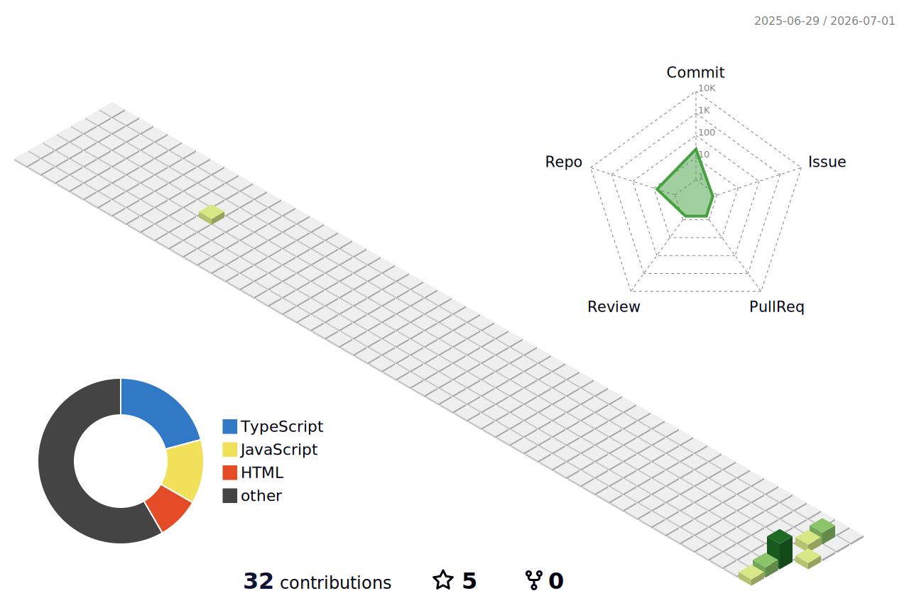

<!-- ╔══════════════════════════════════════════════════════════════════╗ -->
<!-- ║               PEDDI SAI VENKAT SUMANTH — GitHub Profile         ║ -->
<!-- ║               ✨ Crafted with precision & passion ✨             ║ -->
<!-- ╚══════════════════════════════════════════════════════════════════╝ -->

<!-- ═══ TERMINAL HEADER WINDOW ═══ -->

 

<!-- ═══ MONOSPACE TYPING BANNERS ═══ -->

 

 

<!-- ═══ NATIVE SOCIALS ═══ -->
&nbsp;
&nbsp;
&nbsp;

  

<!-- ═══════════════════════ ABOUT ME SECTION ═══════════════════════ -->

## 👤 $ neofetch --profile

<pre style="font-family: 'Fira Code', monospace; background-color: #0d1117; color: #c9d1d9; border: 1px solid #30363d; border-radius: 6px; padding: 18px; line-height: 1.6; box-shadow: 0 4px 12px rgba(0,0,0,0.5);">
sumanth@peddi-terminal:~$ neofetch
          .            User: Peddi Sai Venkat Sumanth (Sumanth)
         / \           Education: B.Tech CSE @ NNRES (2023 - 2027)
        /   \          CGPA: 7.45 / 10.0 (Highly Consistent)
       /     \         Location: Hyderabad, India 🇮🇳
      /       \        Languages: Python, Java, C, C#
     /=========\       Skills: Git, VS Code, MySQL, Unity, HTML/CSS/JS
    /           \      Exploring: React, Node.js, TensorFlow, Quantum Computing
   /             \     Vibe: Coffee-driven developer turning ideas into reality ☕
  /               \    Goal: Secure a Software Internship &amp; build cool products
</pre>

 

<!-- ═══════════════════════ INTERACTIVE WORKSPACE TREE ═══════════════════════ -->

## 📂 $ tree sumanth-workspace/

<pre style="font-family: 'Fira Code', monospace; background-color: #0d1117; color: #c9d1d9; border: 1px solid #30363d; border-radius: 6px; padding: 18px; line-height: 1.6;">

<b>📁 sumanth-workspace/</b> (Click folders to collapse/expand)

│

├── 📂 projects/

│   ├── 🤖 <a href="#-project-1-ai-study-buddy" style="color: #a5d6ff; text-decoration: none;">ai-study-buddy.py</a> (Plan Smart. Study Better. NLP + RAG)
│   ├── 🏋️ <a href="#-project-2-healthmate" style="color: #a5d6ff; text-decoration: none;">healthmate.js</a> (Full-Stack + AI Fitness Coaching chatbot)
│   └── 🎮 <a href="#-project-3-last-thief-standing" style="color: #a5d6ff; text-decoration: none;">last-thief-standing.cs</a> (Shipped Unity 2D physics runner game)

│

├── 📂 academic-milestones/

│   ├── 🎓 btech-cse.log (NNRES | 2023 - 2027 | CGPA: 7.45)
│   ├── 📗 intermediate.log (Sri Chaitanya | 2021 - 2023 | 81%)
│   └── 📘 ssc.log (Suprabath Model HS | 2019 - 2021 | 69%)

│

└── 📄 contact.sh (Click to expand connect scripts)

    ├── 📧 <a href="mailto:saivenkatsumanth9@gmail.com" style="color: #a5d6ff; text-decoration: none;">email_client.sh</a> (saivenkatsumanth9@gmail.com)
    └── 🔗 <a href="https://linkedin.com/in/saivenkatsumanth" style="color: #a5d6ff; text-decoration: none;">linkedin_connect.sh</a> (in/saivenkatsumanth)

</pre>

 

<!-- ═══════════════════════ INTERACTIVE SECRET DRAWER ═══════════════════════ -->

  

    <pre style="font-family: 'Fira Code', monospace; background: #161b22; color: #58a6ff; border: 1px solid #30363d; border-radius: 6px; padding: 12px; cursor: pointer; box-shadow: 0 2px 5px rgba(0,0,0,0.2);">$ ./run-diagnostic-report.sh  # 👈 CLICK TO EXECUTE</pre>
  

  <pre style="font-family: 'Fira Code', monospace; background: #050505; color: #7ee787; border: 1px solid #30363d; border-radius: 6px; padding: 18px; line-height: 1.5;">
[INFO] Connecting to saivenkatsumanth9-stack... SUCCESS
[INFO] Booting interactive shell... SUCCESS
-----------------------------------------------------------
⚡ <b>SYSTEM INTEGRITY REPORT:</b>
- <b>Coding Speed:</b> Optimized &amp; Caffeine-Accelerated
- <b>Clean Code:</b> Strict adherence to DRY &amp; SOLID principles
- <b>Development Approach:</b> Hands-on building (No placeholder copies)
- <b>Current Target:</b> Seeking collaborative Software Internships

[SUCCESS] Executed ./run-diagnostic-report.sh successfully.
  </pre>

 

<!-- ═══════════════════════ TECH MARQUEE ═══════════════════════ -->

## ⚙️ $ cat /etc/environment

<!-- Scrolling terminal status logs -->

  

<!-- ═══════════════════════ FEATURED PROJECTS ═══════════════════════ -->

## 🛠️ $ ls -la ./projects/

<!-- PROJECT 1 -->

<h3>🤖 Project 1: AI Study Buddy</h3>
<pre style="font-family: 'Fira Code', monospace; background-color: #0d1117; color: #c9d1d9; border: 1px solid #30363d; border-radius: 6px; padding: 18px; line-height: 1.6;">
$ python study_buddy.py --enable-rag
>>> Loading RAG Chat Engine... [SUCCESS]
>>> Initializing Scheduler... [SUCCESS]

<b>Description:</b>
Undergraduate-level AI assistant implementing production-grade RAG.
Allows students to query syllabus materials and optimize study routines.

<b>Tech Stack:</b> Python • NLP • RAG • TensorFlow • OpenAI API

<b>Core Features:</b>
- 🧠 <b>Smart Scheduling:</b> Personalized timetables dynamically adjusted by AI.
- 📄 <b>RAG Chat Engine:</b> Upload coursework PDFs and query them in natural language.
- 📝 <b>Auto Quiz Gen:</b> Generates customized practice tests from documents.
</pre>

 

<!-- PROJECT 2 -->

<h3>🏋️ Project 2: HealthMate</h3>
<pre style="font-family: 'Fira Code', monospace; background-color: #0d1117; color: #c9d1d9; border: 1px solid #30363d; border-radius: 6px; padding: 18px; line-height: 1.6;">
$ npm run start --project=healthmate
>>> Connecting to Fitness Chatbot API... [SUCCESS]
>>> Loading Meal &amp; Workout Loggers... [SUCCESS]

<b>Description:</b>
A full-stack, responsive health application featuring workout logging,
nutrition tracking, and an integrated AI fitness chatbot.

<b>Tech Stack:</b> HTML5 • CSS3 • JavaScript • OpenAI API

<b>Core Features:</b>
- 📱 <b>Onboarding &amp; Dashboards:</b> Seamless UI flow with interactive charts.
- 🔢 <b>Health Calculators:</b> Instant BMI, BMR, and TDEE math.
- 🤖 <b>AI Coach:</b> Personalized workout and nutritional suggestions.
</pre>

 

<!-- PROJECT 3 -->

<h3>🎮 Project 3: Last Thief Standing</h3>
<pre style="font-family: 'Fira Code', monospace; background-color: #0d1117; color: #c9d1d9; border: 1px solid #30363d; border-radius: 6px; padding: 18px; line-height: 1.6;">
# run LTS_Game.x86_64
>>> Starting Unity Engine Core... [SUCCESS]
>>> Initializing Game Physics &amp; AI... [SUCCESS]

<b>Description:</b>
A fully shipped, physics-based 2D endless runner built from scratch.
Implements scaling obstacles, coin rewards, and adaptive difficulty.

<b>Tech Stack:</b> Unity Engine • C# scripting • 2D Animation • Game Physics

<b>Core Features:</b>
- 🕹️ <b>Combat Mechanics:</b> Jump, shoot, and loot loop with responsive controls.
- 🤖 <b>Intelligent Enemy AI:</b> Obstacles and enemies react dynamically to player moves.
- 📈 <b>Difficulty Scaling:</b> Game speed scales seamlessly relative to player distance.
</pre>

 

<!-- ═══════════════════════ GITHUB STATS DASHBOARD ═══════════════════════ -->

## 📊 $ cat /var/log/github/stats

<picture>
  <source media="(prefers-color-scheme: dark)" srcset="https://github-readme-stats.vercel.app/api?username=saivenkatsumanth9-stack&show_icons=true&hide_border=true&count_private=true&include_all_commits=true&title_color=58a6ff&icon_color=7ee787&text_color=c9d1d9&bg_color=0d1117&rank_icon=github&show=reviews,discussions_started,prs_merged"/>
  
</picture>
<picture>
  <source media="(prefers-color-scheme: dark)" srcset="https://streak-stats.demolab.com?user=saivenkatsumanth9-stack&hide_border=true&background=0d1117&ring=58a6ff&fire=ff7b72&currStreakLabel=58a6ff&sideLabels=c9d1d9&dates=8b949e&currStreakNum=c9d1d9&sideNums=c9d1d9"/>
  
</picture>

  

<picture>
  <source media="(prefers-color-scheme: dark)" srcset="https://github-readme-stats.vercel.app/api/top-langs/?username=saivenkatsumanth9-stack&layout=donut&hide_border=true&bg_color=0d1117&title_color=58a6ff&text_color=c9d1d9&langs_count=8"/>
  
</picture>

 

<!-- ═══════════════════════ CONTRIBUTION GRAPH ═══════════════════════ -->

## 📈 $ journalctl -u contribution-activity.service

 

<!-- ═══════════════════════ SNAKE ANIMATION ═══════════════════════ -->

## 🐍 $ ./run-contribution-snake --theme=terminal

<picture>
  <source media="(prefers-color-scheme: dark)" srcset="https://raw.githubusercontent.com/saivenkatsumanth9-stack/saivenkatsumanth9-stack/output/github-snake-dark.svg"/>
  <source media="(prefers-color-scheme: light)" srcset="https://raw.githubusercontent.com/saivenkatsumanth9-stack/saivenkatsumanth9-stack/output/github-snake.svg"/>
  
</picture>

 

🔧 <i>Auto-generated every 12 hours via GitHub Actions</i>

 

<!-- ═══════════════════════ 3D CONTRIBUTION GRAPH ═══════════════════════ -->

## 🌐 $ ./render-3d-map --output=rainbow

<picture>
  <source media="(prefers-color-scheme: dark)" srcset="./profile-3d-contrib/profile-night-rainbow-animate.svg"/>
  
</picture>

 

🔧 <i>Auto-generated daily via GitHub Actions</i>

 

<!-- ═══════════════════════ TERMINAL FOOTER DIVIDER ═══════════════════════ -->

<!-- ═══════════════════════ FOOTER ═══════════════════════ -->

 

*"Code is like humor. When you have to explain it, it's bad."* — **Cory House**

 

**Made with 💻 and mass amounts of ☕ by [Sumanth](https://github.com/saivenkatsumanth9-stack)**

 

