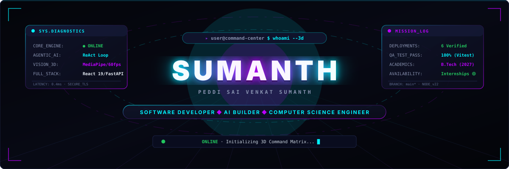

<div align="center">

<!-- ═══════════════════════ 3D CYBERNETIC HERO COMMAND CENTER ═══════════════════════ -->


<br/>

<!-- ═══════════════════════ DYNAMIC MONOSPACE TYPING TERMINAL ═══════════════════════ -->
<a href="https://github.com/saivenkatsumanth9-stack">
  
</a>

<br/>

<!-- ═══════════════════════ HOLOGRAPHIC ACCESS PILLS ═══════════════════════ -->
<a href="https://linkedin.com/in/saivenkatsumanth"></a>&nbsp;
<a href="https://github.com/saivenkatsumanth9-stack"></a>&nbsp;
<a href="mailto:saivenkatsumanth9@gmail.com"></a>&nbsp;
<a href="https://benefit-navigator-main.vercel.app"></a>

<br/><br/>

</div>


### 🎛️ `01 // DEVELOPER COMMAND DASHBOARD`

```yaml
system_telemetry:
  identity: "PEDDI SAI VENKAT SUMANTH (SUMANTH)"
  primary_focus: "Architecting Agentic AI, Real-Time Computer Vision & Scalable Full-Stack Systems"
  education: "B.Tech in Computer Science and Engineering @ NNRES (2023 – 2027) | CGPA: 7.45/10.0"
  location: "Hyderabad, India 🇮🇳"
  availability: "🟢 Open for High-Impact Software Engineering Internships & Hackathon Teams"

disciplines:
  - 🤖 Software Developer & Full-Stack Architect (React 19, TypeScript, TanStack Start, FastAPI)
  - 🧠 AI Builder & Agentic Engineer (ReAct Loops, Deterministic Planners, RAG Pipelines)
  - 👁️ Computer Vision & 3D Spatial Developer (MediaPipe 21-Landmark WASM, Three.js WebGL)
  - 📊 Data Engineering Enthusiast & ML Practitioner (Scikit-Learn, Time-Series Prophet, AST Evaluation)
  - 🎮 Unity & Game Mechanics Developer (C#, Physics Simulations, Procedural Audio Synthesizers)
```


### 🚀 `02 // MISSION CONTROL — FEATURED SYSTEMS & BUILDS`

<table>
  <!-- BENEFITX & HANDSCAPE -->
  <tr>
    <td width="50%" valign="top">
      <div align="left">
        <h3>🏛️ 01. BENEFITX</h3>
        <p><strong>AI-Powered Welfare Scheme Discovery & Application Readiness Engine</strong></p>
        <p>An enterprise-grade GovTech decision-support platform bridging the discovery gap between complex government schemes and eligible citizens. Features a 17-route application suite with dedicated citizen and officer verification consoles.</p>
        <ul>
          <li><strong>5 Decision Engines:</strong> Profile Recommendation Scoring, Explainable Criteria Matching, Document Readiness Evaluator, What-If Simulator, and Multilingual Translation (EN/TE/HI).</li>
          <li><strong>Quality & Tests:</strong> 40/40 Unit Tests passing with Vitest.</li>
        </ul>
        <p>
          
          
          
          
          
        </p>
        <p>
          <a href="https://github.com/saivenkatsumanth9-stack/BENEFITX"><strong>📁 GitHub Repository</strong></a> • 
          <a href="https://benefit-navigator-main.vercel.app"><strong>🌐 Live Portal</strong></a>
        </p>
      </div>
    </td>
    <td width="50%" valign="top">
      <div align="left">
        <h3>🎮 02. HANDSCAPE</h3>
        <p><strong>3D Cyber Escape Room Controlled by Real-Time Computer Vision</strong></p>
        <p>An immersive browser-based 3D escape room game where your hands are the physical controller. Uses webcam frames + Google MediaPipe to extract 21 3D skeletal landmarks per hand at 60 FPS with zero hardware barriers or VR controllers.</p>
        <ul>
          <li><strong>11 Kinetic Gestures:</strong> Real-time Pinch, Point, Grab, Fist, Open Palm, Wrist Roll, Directional Swipes, and Dual-Hand Synchrony across 7 sealed chambers.</li>
          <li><strong>100% Client-Side Privacy:</strong> Zero video frames leave the browser + procedural Web Audio synthesizer.</li>
        </ul>
        <p>
          
          
          
          
          
        </p>
        <p>
          <a href="https://github.com/saivenkatsumanth9-stack/HandScapeGame-"><strong>📁 GitHub Repository</strong></a> • 
          <a href="https://github.com/saivenkatsumanth9-stack/HandScapeGame-#-demo-video"><strong>🎥 Demo Video</strong></a>
        </p>
      </div>
    </td>
  </tr>
  <!-- AGENTIC RESEARCH AGENT & FINFLOW -->
  <tr>
    <td width="50%" valign="top">
      <div align="left">
        <h3>🔎 03. Agentic Research Agent</h3>
        <p><strong>Autonomous Multi-Tool ReAct Agent with Deterministic Goal Decomposition</strong></p>
        <p>An autonomous research agent implementing the ReAct (<code>Thought → Action → Observation</code>) loop built on FastAPI. Deconstructs compound inquiries into subgoals and chains specialized tools to synthesize verified results with 100% audit traces.</p>
        <ul>
          <li><strong>Tool Pipeline:</strong> Safe AST Calculator (no unsafe <code>eval</code>), Wikipedia Summary, Web Search, URL Reader, and Scratchpad Notepad.</li>
          <li><strong>Zero API Overhead:</strong> Fully functional offline-safe design with 0 mandatory paid API keys.</li>
        </ul>
        <p>
          
          
          
          
        </p>
        <p>
          <a href="https://github.com/saivenkatsumanth9-stack/05-agentic-research-agent"><strong>📁 GitHub Repository</strong></a>
        </p>
      </div>
    </td>
    <td width="50%" valign="top">
      <div align="left">
        <h3>💳 04. FinFlow Finance Tracker</h3>
        <p><strong>Personal Finance Platform & In-Browser Camera Receipt OCR Scanner</strong></p>
        <p>A dark-first, client-side personal finance web app designed for young professionals and students. Features customized debit spend caps, dynamic banking ledger labels ("Credited To" / "Debited From"), and local heuristic AI.</p>
        <ul>
          <li><strong>Offline OCR & FLO AI:</strong> In-browser Tesseract.js OCR parses receipt totals; FLO local AI analyzes monthly cash flow and burn rate.</li>
          <li><strong>100% Data Privacy:</strong> All transaction records remain encrypted locally in browser storage.</li>
        </ul>
        <p>
          
          
          
          
        </p>
        <p>
          <a href="https://github.com/saivenkatsumanth9-stack/finflow-finance-tracker"><strong>📁 GitHub Repository</strong></a>
        </p>
      </div>
    </td>
  </tr>
  <!-- STUDYBUDDY & CLASSWIZ STUDIO -->
  <tr>
    <td width="50%" valign="top">
      <div align="left">
        <h3>📚 05. StudyBuddy AI</h3>
        <p><strong>Gamified RAG Learning Platform & Dynamic Exam Assistant</strong></p>
        <p>A full-stack AI learning platform built with TanStack Start, React 19, and Supabase. Supports uploading lecture PDFs (up to 20MB) to chat contextually with notes using Retrieval-Augmented Generation (RAG).</p>
        <ul>
          <li><strong>Core Capabilities:</strong> Dynamic study timetable generation, automated syllabus-aligned multiple choice quizzes, and Pomodoro streak metrics.</li>
        </ul>
        <p>
          
          
          
          
        </p>
        <p>
          <a href="https://github.com/saivenkatsumanth9-stack/studybudy-LLM"><strong>📁 GitHub Repository</strong></a>
        </p>
      </div>
    </td>
    <td width="50%" valign="top">
      <div align="left">
        <h3>🧮 06. ClassWiz Studio</h3>
        <p><strong>Casio fx-991CW Inspired Scientific Calculator & Graphing Engine</strong></p>
        <p>A web-based scientific calculator inspired by the Casio fx-991CW ClassWiz. Features AST mathematical parsing, 2D Cartesian function plotting, quadratic/linear equation solvers, voice math speech input, and an 80+ formula library.</p>
        <ul>
          <li><strong>Image-to-Solve:</strong> In-browser Tesseract.js OCR parses math formulas from photo uploads.</li>
        </ul>
        <p>
          
          
          
          
        </p>
        <p>
          <a href="https://github.com/saivenkatsumanth9-stack/Smart-Calculator"><strong>📁 GitHub Repository</strong></a>
        </p>
      </div>
    </td>
  </tr>
</table>


### ⚔️ `03 // TECH ARSENAL & CORE CAPABILITIES`

<div align="center">

| Operational Domain | Weaponry & Technologies |
| :--- | :--- |
| **Core Languages** |        |
| **Frontend & 3D WebGL** |       |
| **AI, Vision & NLP** |       |
| **Backend & Cloud Matrix** |       |
| **Databases & DevOps** |       |

</div>


### 📊 `04 // SYSTEM DIAGNOSTICS & GITHUB TELEMETRY`

<div align="center">

<table>
  <tr>
    <td width="50%" align="center">
      
    </td>
    <td width="50%" align="center">
      
    </td>
  </tr>
  <tr>
    <td colspan="2" align="center">
      
    </td>
  </tr>
</table>

<br/>

<!-- Contribution Activity Graph -->


<br/><br/>

<!-- Snake Matrix Animation -->
<h3>🐍 Contribution Snake Matrix</h3>

<picture>
  <source media="(prefers-color-scheme: dark)" srcset="https://raw.githubusercontent.com/saivenkatsumanth9-stack/saivenkatsumanth9-stack/output/github-snake-dark.svg"/>
  <source media="(prefers-color-scheme: light)" srcset="https://raw.githubusercontent.com/saivenkatsumanth9-stack/saivenkatsumanth9-stack/output/github-snake.svg"/>
  
</picture>

</div>


### 🕹️ `05 // INTERACTIVE DEVELOPER COMMAND CENTER`

Explore the standalone interactive **React 19 + TypeScript + Vite + Tailwind CSS v4** Developer Command Center located in [`portfolio/`](./portfolio):

- 💻 **Live Floating CLI Terminal (`$`):** Interactive shell emulator (`help`, `projects`, `skills`, `whoami`, `sudo hire-me`).
- ⚡ **Command Palette (`Ctrl+K` / `⌘K`):** Fuzzy-search navigation through all projects, architectures, and deep dives.
- 🔬 **Interactive ReAct Simulator:** Step-by-step visual debugger for agentic reasoning loops (`User → Thought → Action → Tool → Observation → Synthesis`).
- 🎯 **Click-to-Filter Tech Matrix:** Interactive badge matrix that filters and highlights matching builds across the workspace.

```bash
# Clone and run the developer command center locally:
git clone https://github.com/saivenkatsumanth9-stack/saivenkatsumanth9-stack.git
cd saivenkatsumanth9-stack/portfolio
npm install
npm run dev
```


### 📡 `06 // TRANSMISSION UPLINK — CONNECT & COLLABORATE`

<div align="center">

I am actively open to **Software Engineering Internships**, **Full-Stack / AI Developer Positions**, and **Hackathon Collaborations**. Let's engineer something groundbreaking together!

<br/>

<a href="https://linkedin.com/in/saivenkatsumanth"></a>&nbsp;&nbsp;
<a href="mailto:saivenkatsumanth9@gmail.com"></a>&nbsp;&nbsp;
<a href="https://github.com/saivenkatsumanth9-stack"></a>&nbsp;&nbsp;
<a href="https://benefit-navigator-main.vercel.app"></a>

<br/><br/>

<!-- Real-time Profile Views Telemetry -->


<br/><br/>

<sub>⚡ <i>Architected & Built by Peddi Sai Venkat Sumanth (Sumanth)</i></sub>

</div>
