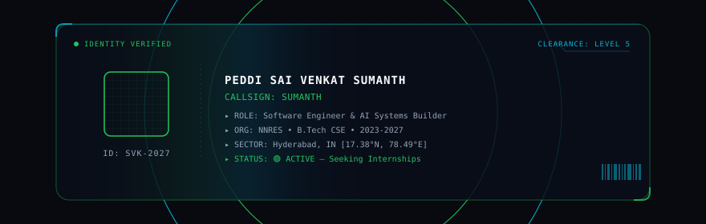
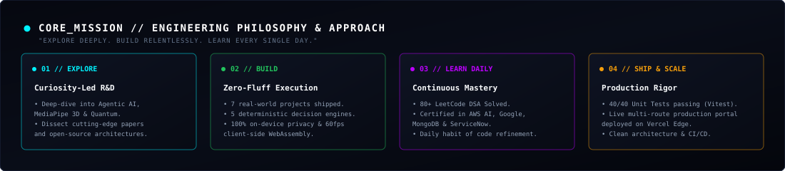
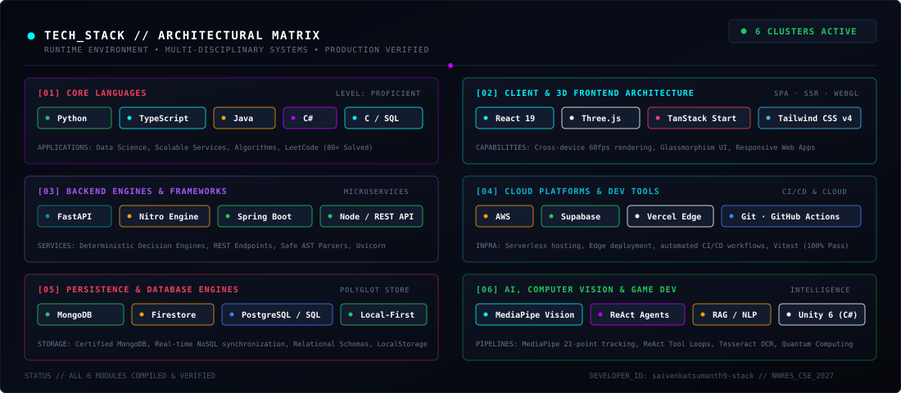
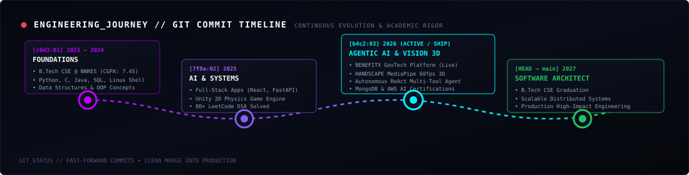
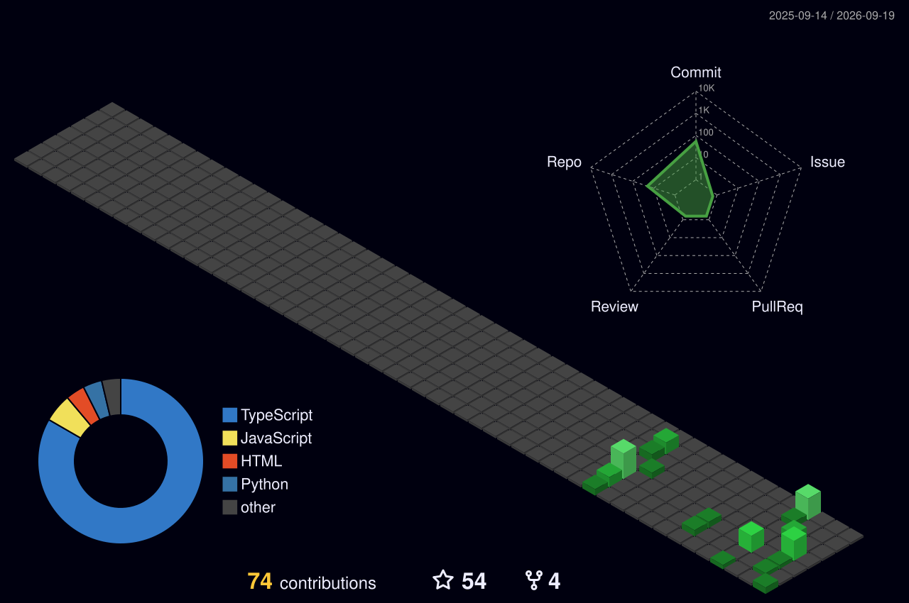

<div align="center">

<!-- ═══════════════════════ CINEMATIC HACKER / DEV HERO ═══════════════════════ -->


<br/>

<!-- ═══════════════════════ TYPING TERMINAL BANNER ═══════════════════════ -->
<a href="https://github.com/saivenkatsumanth9-stack">
  
</a>

<br/>

<!-- ═══════════════════════ TERMINAL ACTION BUTTONS ═══════════════════════ -->
<a href="https://linkedin.com/in/saivenkatsumanth"></a>&nbsp;
<a href="https://github.com/saivenkatsumanth9-stack"></a>&nbsp;
<a href="mailto:saivenkatsumanth9@gmail.com"></a>&nbsp;
<a href="https://benefit-navigator-main.vercel.app"></a>

<br/><br/>

</div>


### 💻 `> ./WHOAMI`

<div align="center">
  
</div>

<br/>

```bash
$ cat /proc/developer_info

┌── SYSTEM IDENTITY ─────────────────────────────────────────────────────────┐
│ NAME         : Peddi Sai Venkat Sumanth (Sumanth)                          │
│ ROLE         : Software Engineer & AI Systems Builder                      │
│ EDUCATION    : B.Tech in Computer Science & Engineering @ NNRES            │
│ TIMELINE     : 2023 – 2027 | CGPA: 7.45 / 10.0                             │
│ LOCATION     : Hyderabad, India [17.3850° N, 78.4867° E]                   │
│ PRIMARY FOCUS: Agentic AI • Real-Time Vision • Full-Stack Web • Cloud      │
│ CURRENT MODE : 🟢 BUILDING (Available for Software Internships & Collabs) │
└────────────────────────────────────────────────────────────────────────────┘
```

<br/>

<div align="center">
  
</div>


### 🎯 `> ./MISSION_AND_APPROACH`

<div align="center">
  
</div>


### ⚙️ `> ./TECH_STACK`

<div align="center">
  
</div>

<br/>

<div align="center">
  
</div>

<br/>

#### 🧠 `> ./NEURAL_INFERENCE_PIPELINE`

<div align="center">
  
</div>


### 🚀 `> ./PROJECTS`

<div align="center">
  
</div>

<br/>

<table>
  <!-- ROW 1: BENEFITX & HANDSCAPE -->
  <tr>
    <td width="50%" valign="top">
      <div align="left">
        <p></p>
        <h3>🏛️ BENEFITX</h3>
        <p><strong>AI-Powered Government Welfare Scheme Discovery & Application Readiness Engine</strong></p>
        <p>An enterprise-grade GovTech platform solving welfare scheme underutilization. Features automated profile criteria matching, document readiness validation, zero-mutation What-If scenario simulations, and plain-language translations for citizens and administrators.</p>
        
```text
[Citizen Input] ➔ [5 Core Decision Engines] ➔ [Nitro Server] ➔ [Scheme Registry]
```

<ul>
          <li><strong>5 Decision Engines:</strong> Profile Recommendation Scoring • Rule-Based Criteria Matching • Document Readiness Tracker • Zero-Mutation What-If Simulator • Multilingual Translation (English, Telugu, Hindi).</li>
          <li><strong>Architecture:</strong> 17-Route Suite with Citizen Portal & Gov-Admin Verification Console.</li>
          <li><strong>QA & Coverage:</strong> 40/40 Unit Tests Passing with Vitest (100% Pass Rate).</li>
        </ul>
        <p>
          
          
          
          
          
        </p>
        <p>
          <a href="https://github.com/saivenkatsumanth9-stack/BENEFITX"></a>&nbsp;
          <a href="https://benefit-navigator-main.vercel.app"></a>
        </p>
      </div>
    </td>
    <td width="50%" valign="top">
      <div align="left">
        <p></p>
        <h3>🎮 HANDSCAPE</h3>
        <p><strong>3D Cyber Escape Room Controlled by Real-Time Computer Vision & Hand Tracking</strong></p>
        <p>A browser-based 3D escape room game where your hands are the physical controller. Evaluates raw webcam frames in real time using client-side machine learning to manipulate 3D mechanisms across 7 tactical chambers with zero hardware barriers.</p>

```text
[Webcam Stream] ➔ [MediaPipe 21-Points] ➔ [LandmarkProcessor] ➔ [Three.js Physics]
```

<ul>
          <li><strong>11 Kinetic Gestures:</strong> Real-time Point, Pinch, Grab, Fist, Open Palm, Wrist Roll, Directional Swipes, and Dual-Hand Synchrony.</li>
          <li><strong>100% Client-Side Privacy:</strong> Zero video frames uploaded or stored; runs via WebAssembly GPU/CPU delegates.</li>
          <li><strong>Procedural Audio:</strong> Pure Web Audio synthesizer generating runtime reactive chords with 0 sound file downloads.</li>
        </ul>
        <p>
          
          
          
          
          
        </p>
        <p>
          <a href="https://github.com/saivenkatsumanth9-stack/HandScapeGame-"></a>&nbsp;
          <a href="https://github.com/saivenkatsumanth9-stack/HandScapeGame-#-demo-video"></a>
        </p>
      </div>
    </td>
  </tr>

  <!-- ROW 2: AGENTIC RESEARCH AGENT & FINFLOW -->
  <tr>
    <td width="50%" valign="top">
      <div align="left">
        <p></p>
        <h3>🔎 Agentic Research Agent</h3>
        <p><strong>Autonomous Multi-Tool ReAct Agent with Safe AST Goal Decomposition</strong></p>
        <p>An inspectable research agent implementing the ReAct (<code>Thought → Action → Observation</code>) loop built on FastAPI. Deconstructs compound multi-part inquiries into discrete subgoals and chains specialized tools to synthesize verified results with 100% audit traces.</p>

```text
[User Goal] ➔ [ReAct Loop] ➔ [Safe AST / Wikipedia / Search] ➔ [Step-by-Step Trace]
```

<ul>
          <li><strong>Multi-Tool Pipeline:</strong> Safe AST-based Calculator (no unsafe <code>eval</code>), Wikipedia Summary, Web Search, URL Fetch Reader, and Scratchpad Notepad.</li>
          <li><strong>Offline-Safe Architecture:</strong> Outbound network tools degrade gracefully to <code>UNAVAILABLE</code> observations without crashing.</li>
          <li><strong>Zero Cost:</strong> Runs fully functional with 0 external paid API keys.</li>
        </ul>
        <p>
          
          
          
          
        </p>
        <p>
          <a href="https://github.com/saivenkatsumanth9-stack/05-agentic-research-agent"></a>&nbsp;
          <a href="https://github.com/saivenkatsumanth9-stack/05-agentic-research-agent#api-reference"></a>
        </p>
      </div>
    </td>
    <td width="50%" valign="top">
      <div align="left">
        <p></p>
        <h3>💳 FinFlow Finance Tracker</h3>
        <p><strong>Personal Finance Platform & In-Browser Receipt OCR Scanning Engine</strong></p>
        <p>A dark-first, privacy-respecting financial tracking platform engineered for university students and salaried professionals with custom debit spend caps and banking ledger semantics.</p>

```text
[Receipt Photo] ➔ [Tesseract.js OCR] ➔ [FLO Local AI] ➔ [Encrypted LocalStorage]
```

<ul>
          <li><strong>In-Browser OCR:</strong> Tesseract.js parses printed receipt line items and monetary totals directly on-device.</li>
          <li><strong>Occupational Presets:</strong> Tailored onboarding for Students (allowances/mess) vs Salaried Employees (salaries/SIPs/rent).</li>
          <li><strong>FLO Local AI:</strong> Heuristic cash flow advisor analyzing recurring spend and 50/30/20 budget partitions.</li>
        </ul>
        <p>
          
          
          
          
        </p>
        <p>
          <a href="https://github.com/saivenkatsumanth9-stack/finflow-finance-tracker"></a>&nbsp;
          <a href="https://github.com/saivenkatsumanth9-stack/finflow-finance-tracker"></a>
        </p>
      </div>
    </td>
  </tr>

  <!-- ROW 3: STUDYBUDDY & LAST STANDING THIEF -->
  <tr>
    <td width="50%" valign="top">
      <div align="left">
        <p></p>
        <h3>📚 StudyBuddy AI</h3>
        <p><strong>Gamified RAG Document Assistant & Dynamic Exam Preparation Platform</strong></p>
        <p>An AI learning platform built with TanStack Start, React 19, and Supabase. Supports uploading lecture PDFs (up to 20MB) to query notes contextually using Retrieval-Augmented Generation (RAG).</p>

```text
[Lecture PDF] ➔ [Vector RAG Embeddings] ➔ [Contextual AI Chat] ➔ [Quiz Engine]
```

<ul>
          <li><strong>Key Capabilities:</strong> Intelligent dynamic study blocks, automated syllabus-aligned multiple choice quizzes, and Pomodoro streak metrics.</li>
        </ul>
        <p>
          
          
          
          
        </p>
        <p>
          <a href="https://github.com/saivenkatsumanth9-stack/studybudy-LLM"></a>
        </p>
      </div>
    </td>
    <td width="50%" valign="top">
      <div align="left">
        <p></p>
        <h3>🎮 Last Standing Thief</h3>
        <p><strong>2D Endless Runner Game Engine Built with Unity & C#</strong></p>
        <p>A fully shipped, physics-based 2D endless runner built in Unity. Implements dynamic obstacle scaling, responsive jump & shoot combat mechanics, coin rewards, and intelligent enemy AI routines.</p>

```text
[Player Input] ➔ [Unity 2D Physics Core] ➔ [Dynamic AI Spawner] ➔ [Score Engine]
```

<ul>
          <li><strong>Game Engine:</strong> Unity Engine • C# Scripting • 2D Animation • Distance-Based Difficulty Progression.</li>
        </ul>
        <p>
          
          
          
          
        </p>
        <p>
          <a href="https://github.com/saivenkatsumanth9-stack"></a>
        </p>
      </div>
    </td>
  </tr>
</table>


### 📜 `> ./ACHIEVEMENTS_AND_CERTIFICATIONS`

<div align="center">
  
</div>

<br/>

```bash
$ cat /etc/credentials/registry.json --verified
```

<table>
  <!-- ROW 1: MONGODB, SERVICENOW, AWS GENAI -->
  <tr>
    <td width="33.3%" valign="top">
      <div align="left">
        <h4>🍃 MongoDB</h4>
        <p><strong>Advanced Database Certification</strong></p>
        <p><em>Credential Record • NoSQL Architecture</em></p>
        <p></p>
      </div>
    </td>
    <td width="33.3%" valign="top">
      <div align="left">
        <h4>⚡ ServiceNow</h4>
        <p><strong>Certified Application Developer (CAD)</strong></p>
        <p><em>Micro-Certifications & Badges</em></p>
        <p></p>
      </div>
    </td>
    <td width="33.3%" valign="top">
      <div align="left">
        <h4>☁️ AWS (Amazon Web Services)</h4>
        <p><strong>DevOps & AI on AWS: Upgrading Apps with GenAI</strong></p>
        <p><em>Coursera • 2026</em></p>
        <p></p>
      </div>
    </td>
  </tr>

  <!-- ROW 2: GOOGLE AI ESSENTIALS, ART OF PROMPTING, QUANTUM -->
  <tr>
    <td width="33.3%" valign="top">
      <div align="left">
        <h4>🤖 Google</h4>
        <p><strong>Google AI Essentials Specialization</strong></p>
        <p><em>Google (Coursera) • 2026</em></p>
        <p></p>
      </div>
    </td>
    <td width="33.3%" valign="top">
      <div align="left">
        <h4>💡 Google</h4>
        <p><strong>Discover the Art of Prompting</strong></p>
        <p><em>Google (Coursera) • 2026</em></p>
        <p></p>
      </div>
    </td>
    <td width="33.3%" valign="top">
      <div align="left">
        <h4>⚛️ Quantum Computing</h4>
        <p><strong>The Complete Quantum Computing Course</strong></p>
        <p><em>Udemy • 2026</em></p>
        <p></p>
      </div>
    </td>
  </tr>

  <!-- ROW 3: UNITY MASTER, PROMPT ENGINEERING, DATA ANALYTICS & LEETCODE -->
  <tr>
    <td width="33.3%" valign="top">
      <div align="left">
        <h4>🎮 Unity 6 & C#</h4>
        <p><strong>Unity 6 & C# Full Master Course</strong></p>
        <p><em>Udemy • 2026</em></p>
        <p></p>
      </div>
    </td>
    <td width="33.3%" valign="top">
      <div align="left">
        <h4>📊 Data Analytics</h4>
        <p><strong>Data Analytics Certification</strong></p>
        <p><em>Verified Record • 2024</em></p>
        <p></p>
      </div>
    </td>
    <td width="33.3%" valign="top">
      <div align="left">
        <h4>🧠 LeetCode</h4>
        <p><strong>80+ DSA Problems Solved</strong></p>
        <p><em>Data Structures & Algorithms</em></p>
        <p></p>
      </div>
    </td>
  </tr>
</table>


### 🧭 `> ./ROADMAP`

<div align="center">
  
</div>


### 📊 `> ./GIT_ACTIVITY`

<div align="center">

<!-- Trophies -->


<br/><br/>

<!-- Stats Grid -->
<table>
  <tr>
    <td width="50%" align="center">
      
    </td>
    <td width="50%" align="center">
      
    </td>
  </tr>
  <tr>
    <td colspan="2" align="center">
      
    </td>
  </tr>
</table>

<br/>

<!-- Contribution Activity Graph -->


<br/><br/>

<!-- 3D Contribution Visualizer -->
<h3>🌐 3D Contribution Landscape</h3>
<picture>
  <source media="(prefers-color-scheme: dark)" srcset="./profile-3d-contrib/profile-night-green.svg"/>
  
</picture>

<br/><br/>

<!-- Contribution Snake -->
<h3>🐍 Contribution Snake Matrix</h3>
<picture>
  <source media="(prefers-color-scheme: dark)" srcset="https://raw.githubusercontent.com/saivenkatsumanth9-stack/saivenkatsumanth9-stack/output/github-snake-dark.svg"/>
  <source media="(prefers-color-scheme: light)" srcset="https://raw.githubusercontent.com/saivenkatsumanth9-stack/saivenkatsumanth9-stack/output/github-snake.svg"/>
  
</picture>

</div>


### 🕹️ `> ./COMMAND_CENTER`

Explore the interactive **React 19 + TypeScript + Vite + Tailwind CSS v4** developer command center application in [`portfolio/`](./portfolio):

- 💻 **Floating Shell Terminal (`$`):** Interactive CLI (`help`, `projects`, `skills`, `whoami`, `sudo hire-me`).
- ⚡ **Fuzzy Command Palette (`Ctrl+K` / `⌘K`):** Instant search and deep-dive architecture inspection.
- 🔬 **Interactive ReAct Simulator:** Step-by-step visual trace inspector for agentic loops.
- 🎯 **Interactive Tech Matrix:** Click any tech badge to filter and highlight matching builds.

```bash
git clone https://github.com/saivenkatsumanth9-stack/saivenkatsumanth9-stack.git
cd saivenkatsumanth9-stack/portfolio
npm install && npm run dev
```


### 📡 `> ./CONNECT`

<div align="center">
  

  <br/><br/>

  <!-- Real-time Traffic Telemetry -->
  

  <br/><br/>

  <sub>⚡ <i>Architected & Maintained by Peddi Sai Venkat Sumanth (Sumanth)</i></sub>
</div>
