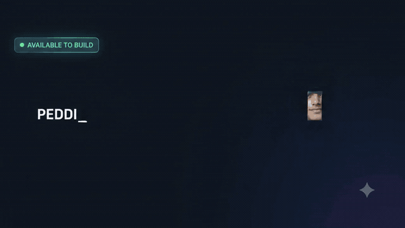
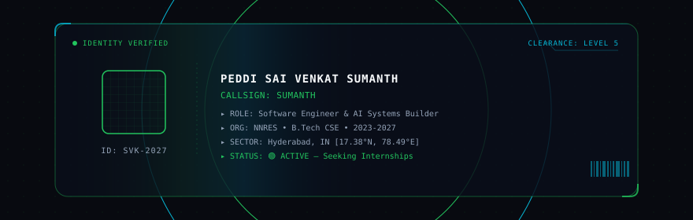
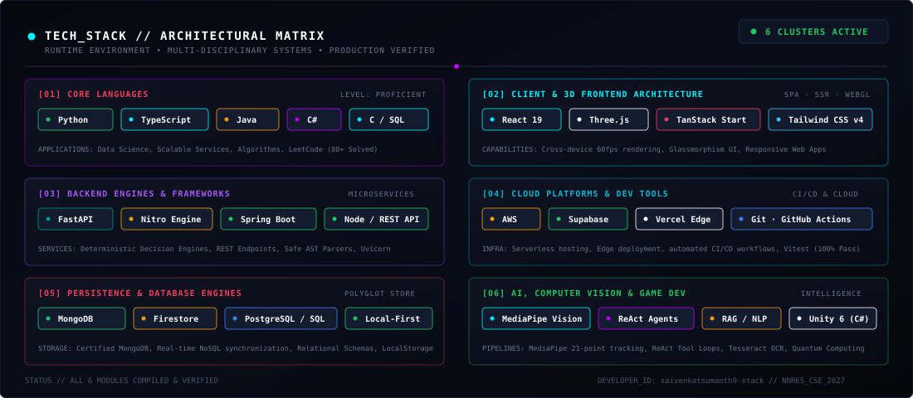
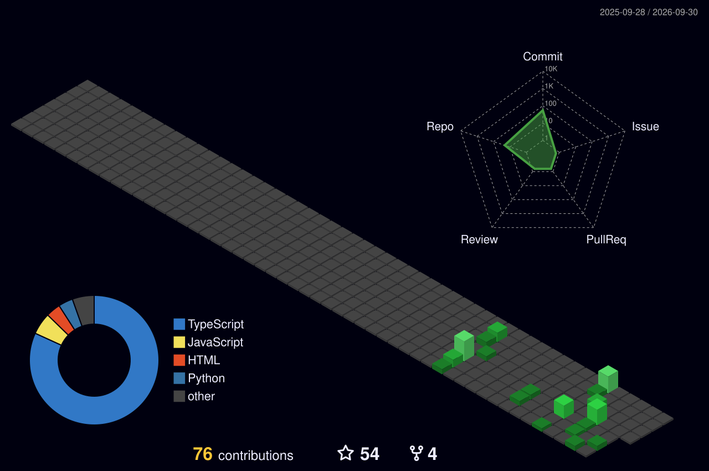
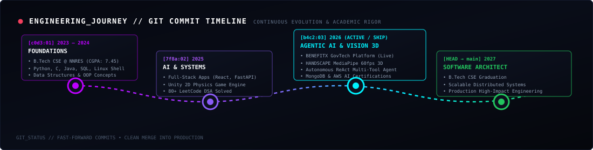

<div align="center">

<!-- ═══════════════════════════════════════════════════════════════════
     HERO HEADER — ANIMATED AI DEVELOPER CORE
     ═══════════════════════════════════════════════════════════════════ -->

<br/>

<p align="center">
  
</p>

# PEDDI SAI VENKAT SUMANTH

### ⚡ AI ENGINEER • SOFTWARE DEVELOPER • FULL-STACK BUILDER
*Turning Ideas Into Impact*

<br/>

<!-- Hero Video Container with Glowing Neon Frame -->
<div align="center">
  <a href="https://github.com/saivenkatsumanth9-stack/saivenkatsumanth9-stack/raw/main/assets/sumanth-hero.mp4" title="Click to view full HD 60FPS video">
    
  </a>
  <br/>
  <sub><i>▲ AI Core Pipeline: Python • AWS • RAG • ML • Java • Real-Time Systems</i></sub>
</div>

<br/>

<!-- Real-time Terminal Typing Banner -->
<a href="https://github.com/saivenkatsumanth9-stack">
  
</a>

<br/>

<!-- Action Links -->
<p align="center">
  <a href="https://psvs-portfolio.vercel.app/"></a>&nbsp;
  <a href="https://github.com/saivenkatsumanth9-stack"></a>&nbsp;
  <a href="https://linkedin.com/in/saivenkatsumanth"></a>&nbsp;
  <a href="mailto:saivenkatsumanth9@gmail.com"></a>&nbsp;
  <a href="https://benefit-navigator-main.vercel.app"></a>
</p>

</div>


<!-- ═══════════════════════════════════════════════════════════════════
     2. IDENTITY & BIO SECTION
     ═══════════════════════════════════════════════════════════════════ -->

### 👤 `> ./IDENTITY`

<div align="center">
  
</div>

<br/>

```bash
$ cat /proc/developer_identity

┌── DEVELOPER IDENTITY RECORD ────────────────────────────────────────────────────────┐
│ NAME         : Peddi Sai Venkat Sumanth (Sumanth)                                  │
│ TITLE        : AI Engineer | Software Developer | Full-Stack Builder               │
│ DEGREE       : B.Tech in Computer Science & Engineering (2023 – 2027)              │
│ INSTITUTION  : Nalla Narasimha Reddy Group of Institutions, Hyderabad, India       │
│ LOCATION     : Hyderabad, Telangana, India [17.3850° N, 78.4867° E]                │
│ CORE MISSION : "I build practical software systems across AI, machine learning,    │
│                 full-stack development, cloud computing and data-driven apps."     │
│ CURRENT MODE : 🟢 ACTIVELY BUILDING • Open for Software Engineering Internships     │
└─────────────────────────────────────────────────────────────────────────────────────┘
```

<div align="center">
  
</div>


<!-- ═══════════════════════════════════════════════════════════════════
     3. CURRENTLY BUILDING
     ═══════════════════════════════════════════════════════════════════ -->

### ⚡ `> ./CURRENTLY_BUILDING`

<table>
  <tr>
    <td width="33.3%" valign="top">
      <div align="left">
        <h4>🤖 AI / ML Systems</h4>
        <p>Designing autonomous agents, heuristic inference engines, and computer vision hand-tracking pipelines with client-side WebAssembly execution.</p>
        <p><code>FastAPI • PyTorch • MediaPipe</code></p>
      </div>
    </td>
    <td width="33.3%" valign="top">
      <div align="left">
        <h4>🌐 Full-Stack Applications</h4>
        <p>Engineering type-safe enterprise web platforms with modern reactive architectures, server-side microservices, and verified test suites.</p>
        <p><code>React 19 • TypeScript • Nitro</code></p>
      </div>
    </td>
    <td width="33.3%" valign="top">
      <div align="left">
        <h4>☁️ Cloud &amp; AWS</h4>
        <p>Deploying serverless event-driven architectures with API Gateway routing, isolated Lambda execution, and document databases.</p>
        <p><code>AWS Lambda • DynamoDB • S3</code></p>
      </div>
    </td>
  </tr>
  <tr>
    <td width="33.3%" valign="top">
      <div align="left">
        <h4>🧠 RAG &amp; Intelligent Systems</h4>
        <p>Building vector embeddings retrieval pipelines that synthesize contextual knowledge from academic and enterprise documents without hallucinations.</p>
        <p><code>Vector RAG • Supabase • LangChain</code></p>
      </div>
    </td>
    <td width="33.3%" valign="top">
      <div align="left">
        <h4>📊 Data &amp; Analytics</h4>
        <p>Automating exploratory data pipelines, tabular parsing, OCR line-item extraction, and statistical metric evaluation.</p>
        <p><code>Pandas • NumPy • Tesseract.js</code></p>
      </div>
    </td>
    <td width="33.3%" valign="top">
      <div align="left">
        <h4>🧩 DSA &amp; System Design</h4>
        <p>Practicing advanced algorithms, memory-optimized data structures, and deterministic finite-state architectures for resilient software.</p>
        <p><code>80+ Solved • LeetCode • C++</code></p>
      </div>
    </td>
  </tr>
</table>


<!-- ═══════════════════════════════════════════════════════════════════
     4. TECH STACK
     ═══════════════════════════════════════════════════════════════════ -->

### 🛠️ `> ./TECH_STACK`

<div align="center">
  
</div>

<br/>

<table>
  <tr>
    <td width="20%" valign="top"><strong>LANGUAGES</strong></td>
    <td width="80%">
      
      
      
      
      
      
    </td>
  </tr>
  <tr>
    <td valign="top"><strong>WEB</strong></td>
    <td>
      
      
      
      
      
      
      
    </td>
  </tr>
  <tr>
    <td valign="top"><strong>AI &amp; DATA</strong></td>
    <td>
      
      
      
      
      
      
      
    </td>
  </tr>
  <tr>
    <td valign="top"><strong>DATABASES</strong></td>
    <td>
      
      
      
      
    </td>
  </tr>
  <tr>
    <td valign="top"><strong>CLOUD &amp; DEVOPS</strong></td>
    <td>
      
      
      
      
      
      
    </td>
  </tr>
  <tr>
    <td valign="top"><strong>DEVELOPMENT</strong></td>
    <td>
      
      
      
      
      
      
      
    </td>
  </tr>
</table>

<br/>

<div align="center">
  
</div>


<!-- ═══════════════════════════════════════════════════════════════════
     5. MAJOR FLAGSHIP PROJECT DEEP DIVE: BODY IQ
     ═══════════════════════════════════════════════════════════════════ -->

### 🏆 `> ./MAJOR_PROJECT: BODY IQ`

<div align="center">
  
</div>

#### **Personalized Fitness, Nutrition and Transformation Optimization Through Integrated Health Analysis**

An end-to-end algorithmic health intelligence system designed to eliminate generic workout and diet guesswork through individualized biometric modeling, metabolic rate calculations, and contextual fitness assistance.

```text
┌─────────────────┐      ┌─────────────────────────┐      ┌──────────────────────────┐
│  USER BIOMETRIC │ ───► │ 4-ENGINE BIOMETRIC CORE │ ───► │ PERSONALIZED WORKOUT     │
│  & DIET INPUT   │      │ BMI • BMR • TDEE • BF%  │      │ & NUTRITION ENGINE       │
└─────────────────┘      └─────────────────────────┘      └──────────────────────────┘
                                      │                                 │
                                      ▼                                 ▼
                         ┌─────────────────────────┐      ┌──────────────────────────┐
                         │ REAL-TIME TRANSFORMATION│      │ CONTEXTUAL AI ASSISTANT  │
                         │ OPTIMIZATION & TRACKING │      │ RETRIEVAL-AUGMENTED (RAG)│
                         └─────────────────────────┘      └──────────────────────────┘
```

- **Problem:** Fitness seekers struggle with cookie-cutter meal plans and arbitrary workout routines that ignore individualized basal metabolic requirements and body composition ratios.
- **Solution:** An automated analytical framework that computes accurate BMR, TDEE, and optimal caloric macros, coupled with a contextual AI advisor for progressive overload adjustments.
- **Core Engineering Modules:**
  - **Health Analysis:** Mifflin-St Jeor metabolic computation ($BMR_{male} = 10w + 6.25h - 5a + 5$) & body composition ratio estimation.
  - **Macro Allocation:** Automatic protein, carbohydrate, and healthy fat distribution mapped to specific fitness goals (Hypertrophy, Recomposition, Deficit).
  - **Transformation Tracking:** Temporal measurement delta logging with adherence visualizers.
  - **AI / RAG Assistant:** Context-aware exercise library guidance and nutrition rule enforcement.
- **Technologies:** `Python` • `FastAPI` • `React` • `TypeScript` • `Vector RAG` • `Supabase`


<!-- ═══════════════════════════════════════════════════════════════════
     6. FEATURED PROJECTS SHOWCASE
     ═══════════════════════════════════════════════════════════════════ -->

### 🚀 `> ./FEATURED_PROJECTS`

<div align="center">
  
</div>

<br/>

<table>
  <!-- ROW 1: BENEFITX & HANDSCAPE -->
  <tr>
    <td width="50%" valign="top">
      <div align="left">
        <p></p>
        <h3>🏛️ BENEFITX</h3>
        <p><strong>AI-Powered Government Welfare Scheme Discovery &amp; Application Readiness Engine</strong></p>
        <p>An enterprise-grade GovTech platform solving welfare scheme underutilization. Features automated profile criteria matching, document readiness validation, zero-mutation What-If scenario simulations, and multilingual translations (English, Telugu, Hindi).</p>
        <ul>
          <li><strong>5 Decision Engines:</strong> Profile Scoring • Rule Matching • Document Tracker • What-If Simulator • Multilingual Engine.</li>
          <li><strong>Verified QA:</strong> 40/40 Unit Tests Passing with Vitest (100% Pass Rate).</li>
        </ul>
        <p>
          
          
          
          
          
        </p>
        <p>
          <a href="https://github.com/saivenkatsumanth9-stack/BENEFITX"></a>&nbsp;
          <a href="https://benefit-navigator-main.vercel.app"></a>
        </p>
      </div>
    </td>
    <td width="50%" valign="top">
      <div align="left">
        <p></p>
        <h3>🎮 HANDSCAPE</h3>
        <p><strong>3D Cyber Escape Room Controlled by Real-Time Computer Vision &amp; Hand Tracking</strong></p>
        <p>A browser-based 3D escape room game where your hands are the physical controller. Evaluates raw webcam frames in real time using client-side machine learning to manipulate 3D mechanisms across 7 chambers with 100% privacy.</p>
        <ul>
          <li><strong>11 Kinetic Gestures:</strong> Point, Pinch, Grab, Fist, Open Palm, Wrist Roll, and Directional Swipes.</li>
          <li><strong>Zero Data Upload:</strong> Pure client-side WebAssembly execution with zero server calls.</li>
        </ul>
        <p>
          
          
          
          
        </p>
        <p>
          <a href="https://github.com/saivenkatsumanth9-stack/HandScapeGame-"></a>&nbsp;
          <a href="https://github.com/saivenkatsumanth9-stack/HandScapeGame-#-demo-video"></a>
        </p>
      </div>
    </td>
  </tr>

  <!-- ROW 2: AGENTIC RESEARCH AGENT & FINFLOW -->
  <tr>
    <td width="50%" valign="top">
      <div align="left">
        <p></p>
        <h3>🔎 Agentic Research Agent</h3>
        <p><strong>Autonomous Multi-Tool ReAct Agent with Safe AST Goal Decomposition</strong></p>
        <p>An inspectable research agent implementing the ReAct (<code>Thought → Action → Observation</code>) loop built on FastAPI. Deconstructs compound multi-part inquiries into discrete subgoals and chains specialized tools with 100% audit traces.</p>
        <ul>
          <li><strong>Safe Execution:</strong> AST-based calculator (no unsafe <code>eval</code>), Wikipedia, Web Search, and Fetch Reader.</li>
          <li><strong>Zero Cost:</strong> Runs fully functional with 0 external paid API keys.</li>
        </ul>
        <p>
          
          
          
          
        </p>
        <p>
          <a href="https://github.com/saivenkatsumanth9-stack/05-agentic-research-agent"></a>&nbsp;
          <a href="https://github.com/saivenkatsumanth9-stack/05-agentic-research-agent#api-reference"></a>
        </p>
      </div>
    </td>
    <td width="50%" valign="top">
      <div align="left">
        <p></p>
        <h3>💳 FinFlow Finance Tracker</h3>
        <p><strong>Personal Finance Platform &amp; In-Browser Receipt OCR Scanning Engine</strong></p>
        <p>A dark-first, privacy-respecting financial tracking platform engineered for university students and salaried professionals with custom debit spend caps and banking ledger semantics.</p>
        <ul>
          <li><strong>In-Browser OCR:</strong> Tesseract.js parses printed receipt line items directly on-device.</li>
          <li><strong>FLO Local AI:</strong> Heuristic cash flow advisor analyzing recurring spend and 50/30/20 budget partitions.</li>
        </ul>
        <p>
          
          
          
          
        </p>
        <p>
          <a href="https://github.com/saivenkatsumanth9-stack/finflow-finance-tracker"></a>&nbsp;
          <a href="https://github.com/saivenkatsumanth9-stack/finflow-finance-tracker"></a>
        </p>
      </div>
    </td>
  </tr>

  <!-- ROW 3: STUDYBUDDY & LAST STANDING THIEF -->
  <tr>
    <td width="50%" valign="top">
      <div align="left">
        <p></p>
        <h3>📚 StudyBuddy AI</h3>
        <p><strong>Gamified RAG Document Assistant &amp; Dynamic Exam Preparation Platform</strong></p>
        <p>An AI learning platform built with TanStack Start, React 19, and Supabase. Supports uploading lecture PDFs (up to 20MB) to query notes contextually using Retrieval-Augmented Generation (RAG).</p>
        <ul>
          <li><strong>Dynamic Quiz Generator:</strong> Generates automated syllabus-aligned multiple choice quizzes from parsed PDFs.</li>
        </ul>
        <p>
          
          
          
        </p>
        <p>
          <a href="https://github.com/saivenkatsumanth9-stack/studybudy-LLM"></a>
        </p>
      </div>
    </td>
    <td width="50%" valign="top">
      <div align="left">
        <p></p>
        <h3>🎮 Last Standing Thief</h3>
        <p><strong>2D Endless Runner Game Engine Built with Unity &amp; C#</strong></p>
        <p>A fully shipped, physics-based 2D endless runner built in Unity. Implements dynamic obstacle scaling, responsive jump &amp; shoot combat mechanics, coin rewards, and intelligent enemy AI routines.</p>
        <ul>
          <li><strong>Game Engine:</strong> Unity Engine • C# Scripting • 2D Animation • Distance-Based Difficulty Progression.</li>
        </ul>
        <p>
          
          
          
        </p>
        <p>
          <a href="https://github.com/saivenkatsumanth9-stack"></a>
        </p>
      </div>
    </td>
  </tr>
</table>


<!-- ═══════════════════════════════════════════════════════════════════
     7. DEVELOPER DASHBOARD
     ═══════════════════════════════════════════════════════════════════ -->

### 📊 `> ./DEVELOPER_DASHBOARD`

```text
┌── DEVELOPER DASHBOARD ──────────────────────────────────────────────────────────────┐
│                                                                                    │
│   PUBLIC REPOSITORIES     TOTAL PRODUCTION BUILDS     UNIT TESTS PASS RATE         │
│          10+                        6+                        100% (40/40)         │
│                                                                                    │
│   PRIMARY FOCUS           DEPLOYMENTS                 CONTRIBUTION STATUS          │
│   AI & Full-Stack         Vercel • AWS • Supabase     ACTIVE & CONTINUOUS          │
│                                                                                    │
└────────────────────────────────────────────────────────────────────────────────────┘
```

<div align="center">

<!-- GitHub Stats Grid -->
<table>
  <tr>
    <td width="50%" align="center">
      
    </td>
    <td width="50%" align="center">
      
    </td>
  </tr>
  <tr>
    <td colspan="2" align="center">
      
    </td>
  </tr>
</table>

<br/>

<!-- Contribution Frequency Activity Graph -->


</div>


<!-- ═══════════════════════════════════════════════════════════════════
     8. 3D CONTRIBUTION CITY & SNAKE VISUALIZATION
     ═══════════════════════════════════════════════════════════════════ -->

### 🌐 `> ./CONTRIBUTION_CITY_AND_PIPELINE`

<p><em>Real GitHub contribution activity mapped into architectural data buildings and dynamic matrix visualization:</em></p>

<div align="center">

<!-- 3D Contribution Landscape -->
<picture>
  <source media="(prefers-color-scheme: dark)" srcset="./profile-3d-contrib/profile-night-green.svg"/>
  
</picture>

<br/><br/>

<!-- Contribution Snake -->
<picture>
  <source media="(prefers-color-scheme: dark)" srcset="https://raw.githubusercontent.com/saivenkatsumanth9-stack/saivenkatsumanth9-stack/output/github-snake-dark.svg"/>
  <source media="(prefers-color-scheme: light)" srcset="https://raw.githubusercontent.com/saivenkatsumanth9-stack/saivenkatsumanth9-stack/output/github-snake.svg"/>
  
</picture>

</div>


<!-- ═══════════════════════════════════════════════════════════════════
     9. CURRENT LEARNING & GROWTH
     ═══════════════════════════════════════════════════════════════════ -->

### 📚 `> ./CURRENT_LEARNING`

<table>
  <tr>
    <td width="35%"><strong>DSA &amp; Problem Solving</strong></td>
    <td width="20%"></td>
    <td width="45%">80+ LeetCode problems solved • Trees, Graphs, Dynamic Programming</td>
  </tr>
  <tr>
    <td><strong>Autonomous AI &amp; Inference Loops</strong></td>
    <td></td>
    <td>Multi-tool ReAct agent loops, prompt engineering, AST parsers</td>
  </tr>
  <tr>
    <td><strong>Cloud Computing &amp; Serverless AWS</strong></td>
    <td></td>
    <td>AWS Lambda, DynamoDB, API Gateway, S3, CloudWatch</td>
  </tr>
  <tr>
    <td><strong>Full-Stack Production Architectures</strong></td>
    <td></td>
    <td>React 19, TypeScript, Nitro SSR, TanStack Start</td>
  </tr>
  <tr>
    <td><strong>Distributed System Design</strong></td>
    <td></td>
    <td>Caching patterns, horizontal scaling, asynchronous message queues</td>
  </tr>
</table>


<!-- ═══════════════════════════════════════════════════════════════════
     10. VIRTUAL INTERNSHIPS & EXPERIENCE
     ═══════════════════════════════════════════════════════════════════ -->

### 💼 `> ./EXPERIENCE`

<table>
  <tr>
    <td width="33.3%" valign="top">
      <div align="left">
        <h4>🏢 CodeSoft</h4>
        <p><strong>Data Science Intern</strong></p>
        <p><em>Virtual Internship</em></p>
        <ul>
          <li>Exploratory data analysis on structured datasets using Python, Pandas, and NumPy.</li>
          <li>Implemented classification and regression baseline models for predictive tasks.</li>
        </ul>
      </div>
    </td>
    <td width="33.3%" valign="top">
      <div align="left">
        <h4>🏢 Prodigy InfoTech</h4>
        <p><strong>Web Development Intern</strong></p>
        <p><em>Virtual Internship</em></p>
        <ul>
          <li>Developed responsive front-end user interfaces using HTML, CSS, and modern JavaScript.</li>
          <li>Implemented interactive UI components and optimized mobile layout viewports.</li>
        </ul>
      </div>
    </td>
    <td width="33.3%" valign="top">
      <div align="left">
        <h4>🏢 CodeSoft</h4>
        <p><strong>Machine Learning Intern</strong></p>
        <p><em>Virtual Internship</em></p>
        <ul>
          <li>Engineered ML workflows with data pre-processing, feature scaling, and Scikit-learn algorithms.</li>
          <li>Evaluated precision, recall, and ROC-AUC metrics across trained models.</li>
        </ul>
      </div>
    </td>
  </tr>
</table>


<!-- ═══════════════════════════════════════════════════════════════════
     11. VERIFIED CREDENTIALS
     ═══════════════════════════════════════════════════════════════════ -->

### 📜 `> ./VERIFIED_CREDENTIALS`

<div align="center">
  
</div>

<br/>

<table>
  <tr>
    <td width="33.3%" valign="top">
      <h4>🍃 MongoDB</h4>
      <p><strong>Advanced Database Certification</strong></p>
      <p></p>
    </td>
    <td width="33.3%" valign="top">
      <h4>⚡ ServiceNow</h4>
      <p><strong>Certified Application Developer (CAD)</strong></p>
      <p></p>
    </td>
    <td width="33.3%" valign="top">
      <h4>☁️ AWS (Coursera)</h4>
      <p><strong>DevOps &amp; AI on AWS: Upgrading Apps with GenAI</strong></p>
      <p></p>
    </td>
  </tr>
  <tr>
    <td valign="top">
      <h4>🤖 Google</h4>
      <p><strong>Google AI Essentials Specialization</strong></p>
      <p></p>
    </td>
    <td valign="top">
      <h4>💡 Google</h4>
      <p><strong>Discover the Art of Prompting</strong></p>
      <p></p>
    </td>
    <td valign="top">
      <h4>⚛️ Quantum Computing</h4>
      <p><strong>The Complete Quantum Computing Course</strong></p>
      <p></p>
    </td>
  </tr>
  <tr>
    <td valign="top">
      <h4>🎮 Unity 6 &amp; C#</h4>
      <p><strong>Unity 6 &amp; C# Master Course</strong></p>
      <p></p>
    </td>
    <td valign="top">
      <h4>📊 Data Analytics</h4>
      <p><strong>Data Analytics Certification</strong></p>
      <p></p>
    </td>
    <td valign="top">
      <h4>🧠 LeetCode</h4>
      <p><strong>80+ Problems Solved</strong></p>
      <p></p>
    </td>
  </tr>
</table>


<!-- ═══════════════════════════════════════════════════════════════════
     12. ROADMAP & TIMELINE
     ═══════════════════════════════════════════════════════════════════ -->

### 🧭 `> ./ROADMAP`

<div align="center">
  
</div>


<!-- ═══════════════════════════════════════════════════════════════════
     13. LET'S CONNECT
     ═══════════════════════════════════════════════════════════════════ -->

### 📡 `> ./LET'S_CONNECT`

<div align="center">
  

  <br/><br/>

  <p align="center">
    <a href="https://github.com/saivenkatsumanth9-stack"></a>&nbsp;&nbsp;
    <a href="https://linkedin.com/in/saivenkatsumanth"></a>&nbsp;&nbsp;
    <a href="https://psvs-portfolio.vercel.app/"></a>&nbsp;&nbsp;
    <a href="mailto:saivenkatsumanth9@gmail.com"></a>
  </p>

  <br/>

  <!-- Real-time Traffic Telemetry -->
  

  <br/><br/>

<!-- ═══════════════════════════════════════════════════════════════════
     14. FINAL MESSAGE
     ═══════════════════════════════════════════════════════════════════ -->

  <h3>BUILD • LEARN • SOLVE • INNOVATE</h3>
  <p><em>"Turning ideas into impact."</em></p>

  <sub>⚡ <i>Architected & Maintained by Peddi Sai Venkat Sumanth</i></sub>
</div>
